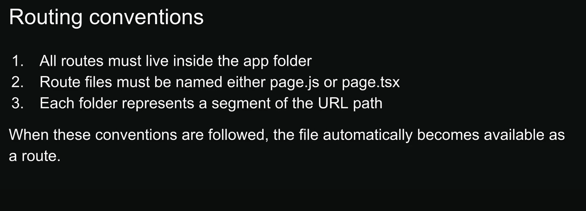
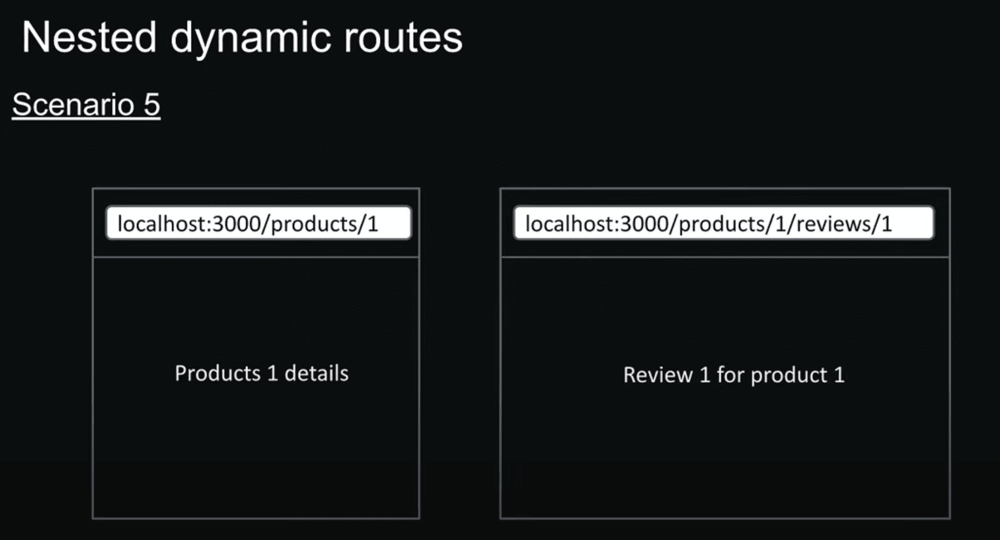
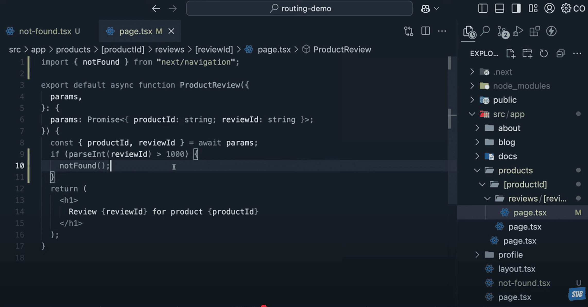
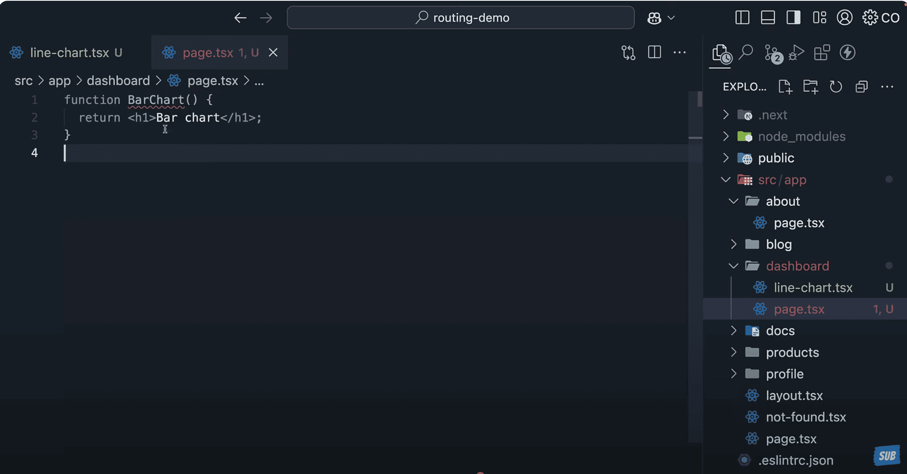
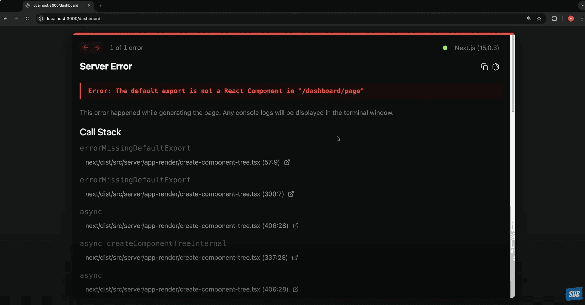
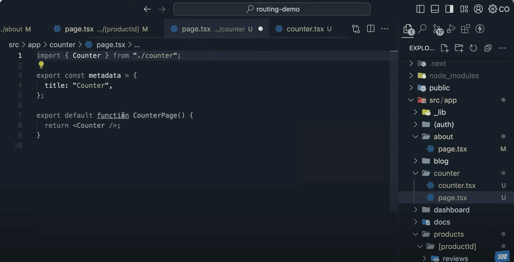

# React Server components

# Create new app

# Router

- page.tsx file automatically maps to your site root url.
- Even though we deleted this layout.tsx file, nextjs will automatically create and set it up once we first access the root route.
- Routes are directly tied with their flder names in the app directory. A page.tsx file in the profile folder will mape to the /profile routes and a page.tsx file in the about folder will map to the /about route.

- If someone tries to visit a url that doesn't maps to any file in the app folder, here nextjs will serve 404 page. We don't need to write any special route to handle these.

- In nextjs we don't need to install and configure a router. Our folder and file structure does all the heavylifting

# Nested routes

# Dynamic routes

- Every page in App router receives route parameters through the param props.
- The type of params is a Promise that resolves to an object containing the dynamic segments as key value pair.
- The nice about server components is that we can use async await to resolve the promise and access the dynamic segemnt

# Nested Dynamic routes

# Catch all Segments

- nextjs also offers optional catch all segments. /docs will show 404 page currently

# Not Found Page

- By default when you visit a route that doesn't exist in your route folder we will see a basic 404 page.
- This page will work fine for development but for production site we might want a customized 404 page.
- Not Found page can also be triggered programmatically using notFound function.
- We can create specific notfound pages for different sections of the app.
- Notfound component doesn't accept props. But we might more data to show different message based on the route parameters. For this we can use the `usePathname` hook from nextjs.
- In the new React server component architecture all React components are server components by default and hooks can only be used in client components. To fix add `"use client"` at the top.

# File Colocation

- A route only becomes publically accessible when you add page.tsx or page.jsx file to it.
- We can safely colocate project files inside the route segements inside app directory without worrying about they accidently becoming routes themselves.

# Private folders

# Route groups

- Route groups are the only way to share a layout between routes without affecting the url.
- To create a route group we simply wrap the folder name in paranthesis. This tells nextjs to treat this folder as an organisational tool only and excluding it from URL path.

# Layouts

- layout.tsx file in the app folder is called the route layout and it is not optional. Even if you delete it nextjs will auto generate it.
- Every layout component needs a children prop. This is where our page content will go.

# Nested layouts

- First nextjs renders the root layout where the children prop representing the productId folder content. then productId layout kicks in replacing the children prop in the root layout. Finally the actual content from the page.tsx from the productId fills the children prop in the productId layout.
- This pattern gives you the power to create specialized layouts for the different parts of the application.

# Multiple Root Layouts

# Routing Metadata And dynamic metadata

- While both page and layout can have metadata, page's metadata take priority when they overlap.
- When routes have multiple metadata objects, they merge together with deeper segments taking priority.
- Metadata won't work with pages marked with `use client` directive. The solution is to keep your metadata in server components and extract any client side functionality in separate component.

