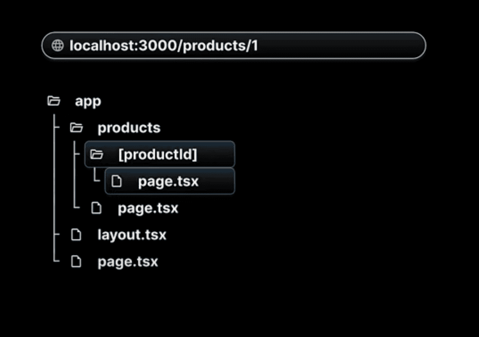

# React Server components

# Create new app

# Router

- page.tsx file automatically maps to your site root url.
- Even though we deleted this layout.tsx file, nextjs will automatically create and set it up once we first access the root route.
- Routes are directly tied with their flder names in the app directory. A page.tsx file in the profile folder will mape to the /profile routes and a page.tsx file in the about folder will map to the /about route.

- If someone tries to visit a url that doesn't maps to any file in the app folder, here nextjs will serve 404 page. We don't need to write any special route to handle these.

- In nextjs we don't need to install and configure a router. Our folder and file structure does all the heavylifting

# Nested routes

# Dynamic routes

- Every page in App router receives route parameters through the param props.
- The type of params is a Promise that resolves to an object containing the dynamic segments as key value pair.
- The nice about server components is that we can use async await to resolve the promise and access the dynamic segemnt

# Nested Dynamic routes

